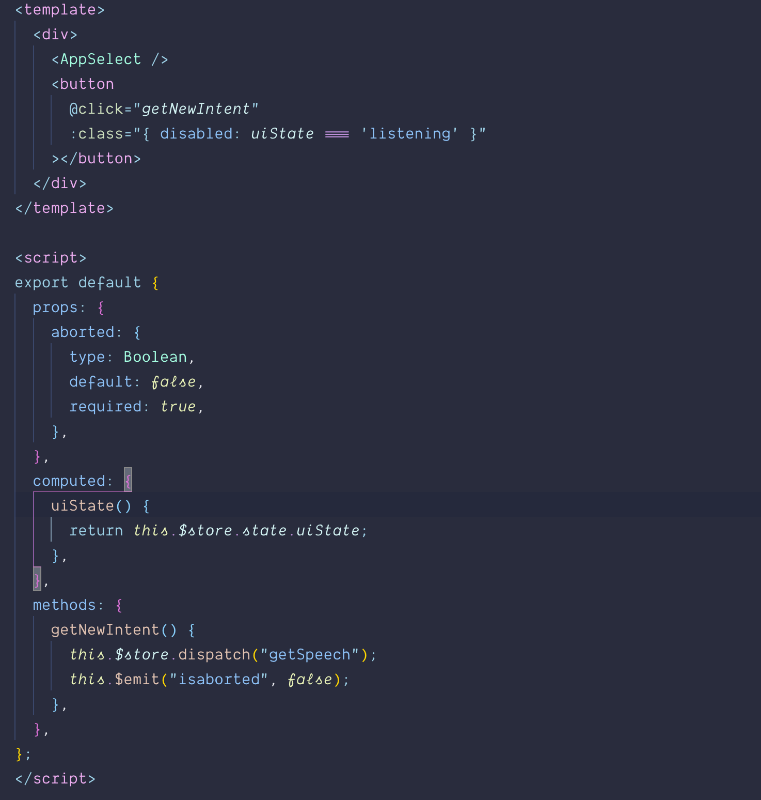
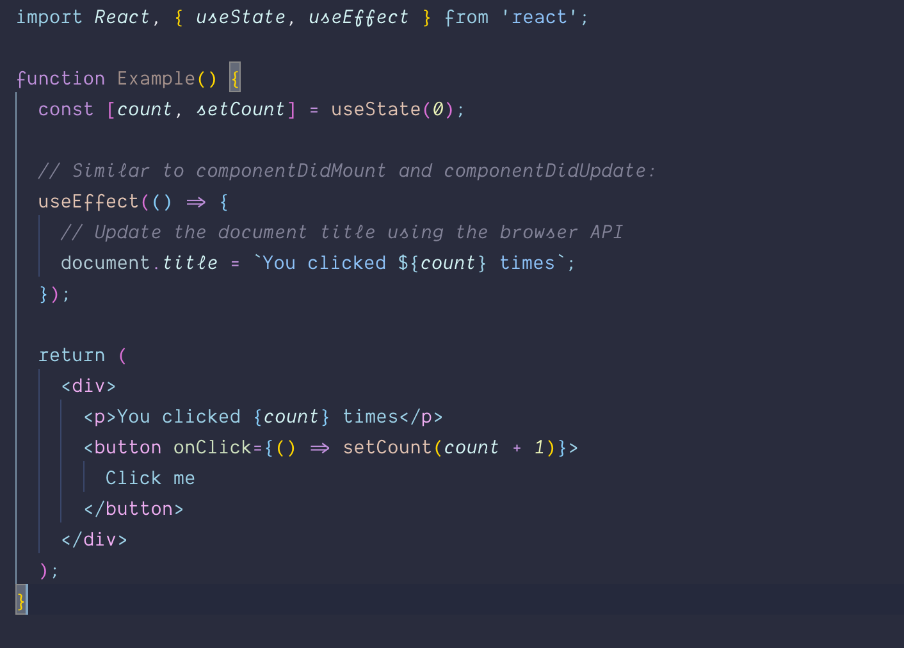
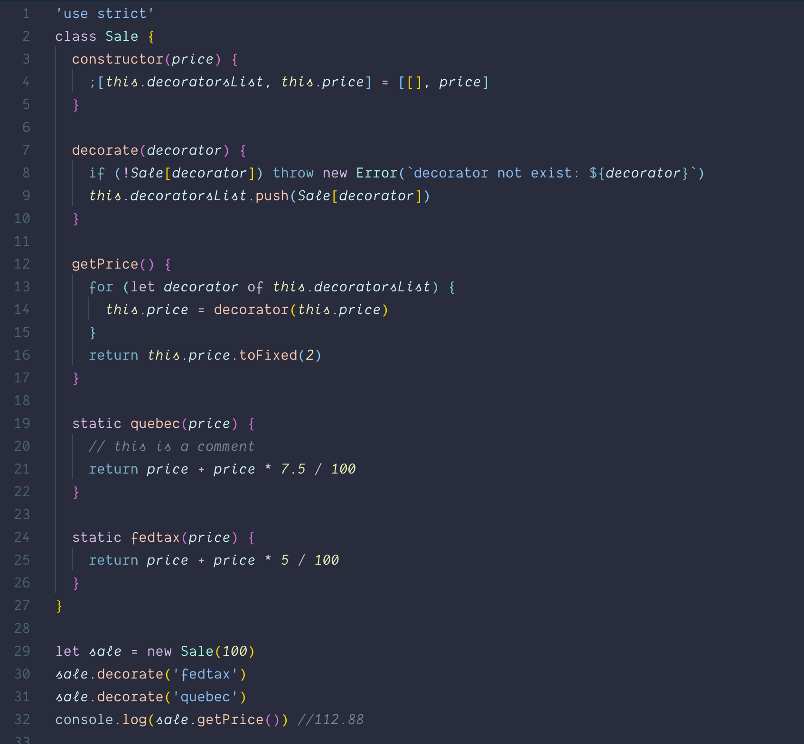
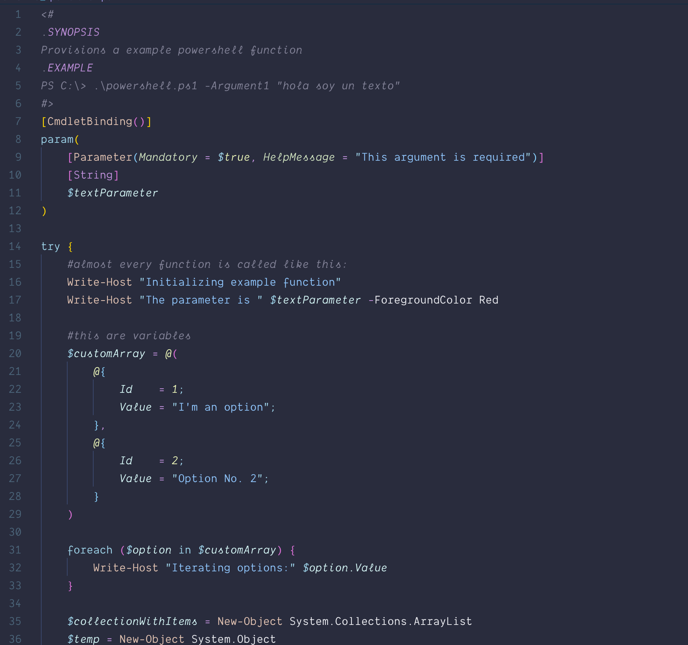

# In Bed By 7pm 🌆

My first VS Code Theme was [Night Owl](https://github.com/sdras/night-owl-vscode-theme), and I got a request for a new kind of theme for other folks: [In Bed By 7pm](https://twitter.com/toddmorey/status/1309982499003564034?s=20).

About this theme, and some of the considerations made while creating it (as well as _how_ to create it should you want to make your own): [https://css-tricks.com/creating-a-vs-code-theme/](https://css-tricks.com/creating-a-vs-code-theme/)

# Installation

1.  Install [Visual Studio Code](https://code.visualstudio.com/)
2.  Launch Visual Studio Code
3.  Choose **Extensions** from menu
4.  Search for `inbedby7`
5.  Click **Install** to install it
6.  Click **Reload** to reload the Code
7.  From the menu bar click: Code > Preferences > Color Theme > **In Bed By 7pm**
